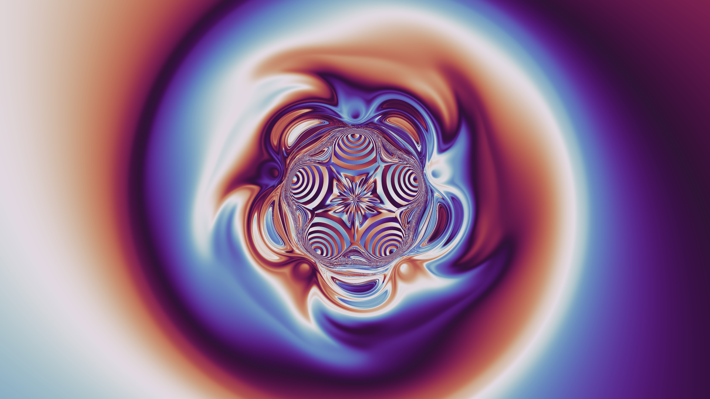
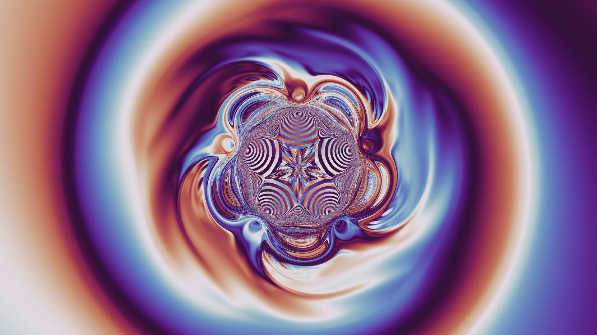

# Fractal basins of attraction — magnetic pendulum swirl

A replication of the r/generative ["Fractal basins of attraction"](https://www.reddit.com/r/generative/comments/w2w3ie/fractal_basins_of_attraction/)
animation: every pixel is an independent particle moving in a potential with
five minima at the corners of a regular pentagon; the pixel's color at any
moment is determined by the direction of the particle's *current* motion.
Chaos makes
neighbouring initial conditions diverge, painting fractal filigree between
coherent swirl arms.

Animation: `renders/pendulum_swirl.mp4` (t = 0 → 24, 30 fps).
Native 4K stills: `renders/*_4k.png`. All other stills are 1920×1080,
rendered at 3840×2160 and Lanczos-downsampled (2× supersampling).

## Model

Each pixel of a 16:9 grid is a particle with initial position at the
pixel's world coordinate, integrated with fixed-step RK4 (dt = 0.01,
converged to ~1e-6 vs dt = 0.0025):

    r'' = −friction·r'                                   (linear drag)
          + Σᵢ strength·(mᵢ − r)/(|mᵢ − r|² + d²)^(3/2)   (five wells, pentagon radius 1)
          − A·r/(|r|² + D²)                               (broad log-potential background)

with friction = 0.02, strength = 2, d = 0.45, A = 0.15, D = 1, and the five
wells on a pentagon of radius 2 (one vertex pointing up, +y). The view spans
x ∈ [−10.67, 10.67], y ∈ [−6, 6].

**Initial velocity** is 0.9× the local circular-orbit velocity, clockwise:
v₀ = −0.9·√(F_inward·r) · θ̂. The 10% sub-circular bias gives every orbit a
gentle radial libration that populates the resonance islands (the big
whorls); exactly-circular starts leave the mid-field a featureless spiral. This is the key to the reference's look — an
accretion-disk-like flow in which every particle starts on a near-circular
orbit. Friction then drives a slow coherent inspiral: the inner flow winds
into spiral arms, particles near the pentagon are captured chaotically into
the five basins (the central flower), and the far field rotates with the
flat rotation curve of the log-potential background.

**Color**: matplotlib's cyclic `twilight` colormap applied to the angle of
the particle's current **velocity**, u = (atan2(vy,vx)/2π) mod 1. For the
circulating far field the velocity angle is the position angle ±90°, so the
t = 0 frame reads white up / blue left / dark down / orange right exactly
like position coloring (and like the reference's first frame) — but a
particle orbiting inside a well sweeps its velocity direction through a full
2π every orbit, which paints the wells as full-palette wound whorls and
makes flat color fills impossible while anything still moves. Position-angle
coloring (the default, without `--vel`) can never do this: a basin cloud at
pentagon radius subtends a small angle from the origin, so each petal stays
one hue and flattens as it settles.

## Why these choices (see experiments/NOTES.md for the full log)

- **No harmonic spring**: a spring makes the far-field dynamics linear —
  color rays stay straight forever, whereas the reference bends its arms all
  the way to the frame corners. The author's phrase "a potential with five
  minima" (no restoring spring) plus a long-range background is what curves
  the whole frame.
- **Circular-orbit initial velocities**: rigid rotation or zero velocity
  either escapes (static corners) or plunges into the pentagon (whole-frame
  salt-and-pepper chaos). Near-circular starts keep the flow laminar for
  tens of time units, exactly like the reference's creamy marbling.
- **Log-potential background** (flat rotation curve): pure Kepler winding
  (Ω ∝ r^{-3/2}) leaves the corners nearly static while the middle over-winds.
  The reference's corners rotate a substantial fraction of a turn while the
  interior is only a few turns in — a flatter Ω(r) ∝ 1/r profile fits.
- **Large pentagon (radius 2), strong wells (2), weak background (A = 0.15)**:
  the big whorls in the reference are resonance islands driven by the
  pentagon's 5-fold perturbation of the circulating flow. A strong background
  swamps that perturbation and yields a sterile clean spiral; strong wells on
  a large pentagon with only a whisper of background spread the whorl field
  across most of the frame.
- **Velocity-angle coloring + near-zero friction (0.02)**: with position-angle
  coloring, basins inevitably flatten into solid patches as particles settle
  (E8/E9); any appreciable friction accelerates this. Velocity coloring makes
  every still-moving region a gradient by construction, and friction 0.02
  means nothing settles within the rendered time span. Well smoothing
  d = 0.45 keeps chaotic scattering gentle (sharp wells leave pixel speckle
  around the flower). The full chain of rejected alternatives — quadratic
  drag, rigid-rotation ICs, weak wells — is in experiments/NOTES.md E8–E10.

## Reproducing

    gcc -O3 -march=native -ffast-math -fopenmp -o sim/pendulum sim/pendulum.c -lm

    # simulate: writes raw float32 (x,y) snapshots per pixel
    DUMPV=1 SPRING=0 STRENGTH=2 FRICTION=0.02 VKEP=-0.9 BGA=0.15 BGD=1 \
      HEIGHT=0.45 MAGRADIUS=2 \
      ./sim/pendulum 3840 2160 -10.6667 10.6667 -6 6 0.01 out/run 0.5 12 16 20

    # render: twilight colormap on velocity angle, 2x supersampled
    python3 render.py 'out/run_*.xy' -W 3840 -H 2160 --offset 0 --vel --supersample 2

    # animation
    python3 scripts/make_animation.py

Timeline landmarks: t ≈ 0.5 reproduces the reference's first image (angular
cone), t ≈ 12–16 the whorl field with wound full-palette well spirals and a
star-flower core, t ≈ 20–28 progressively denser winding. Renders from
earlier parameter iterations (position-angle coloring, higher friction)
remain in git history; experiments/NOTES.md records why each was rejected.
