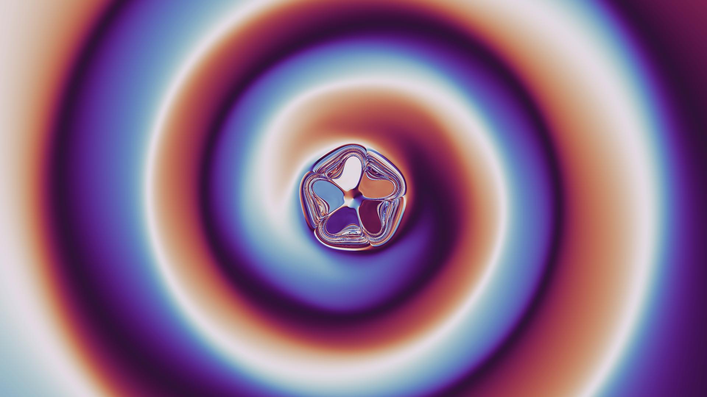
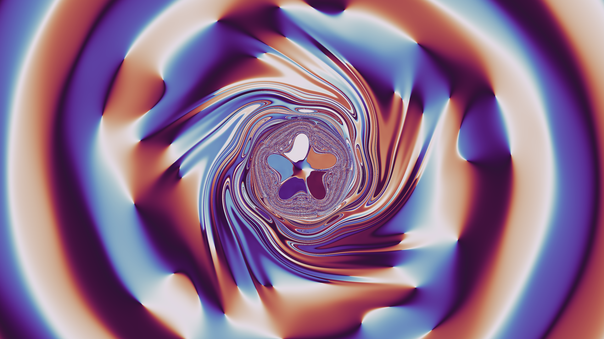

# Fractal basins of attraction — magnetic pendulum swirl

A replication of the r/generative ["Fractal basins of attraction"](https://www.reddit.com/r/generative/comments/w2w3ie/fractal_basins_of_attraction/)
animation: every pixel is an independent particle moving in a potential with
five minima at the corners of a regular pentagon; the pixel's color at any
moment is determined by the particle's *current* position. Chaos makes
neighbouring initial conditions diverge, painting fractal filigree between
coherent swirl arms.

Animation: `renders/pendulum_swirl.mp4` (t = 0 → 20, 30 fps).
Native 4K stills: `renders/*_4k.png`. All other stills are 1920×1080,
rendered at 3840×2160 and Lanczos-downsampled (2× supersampling).

## Model

Each pixel of a 16:9 grid is a particle with initial position at the
pixel's world coordinate, integrated with fixed-step RK4 (dt = 0.01,
converged to ~1e-6 vs dt = 0.0025):

    r'' = −friction·r'                                   (linear drag)
          + Σᵢ strength·(mᵢ − r)/(|mᵢ − r|² + d²)^(3/2)   (five wells, pentagon radius 1)
          − A·r/(|r|² + D²)                               (broad log-potential background)

with friction = 0.12, strength = 1, d = 0.45, A = 0.3, D = 1, and the five
wells on a pentagon of radius 1.5 (one vertex pointing up, +y). The view
spans x ∈ [−8.89, 8.89], y ∈ [−5, 5].

**Initial velocity** is the local circular-orbit velocity, clockwise:
v₀ = −√(F_inward·r) · θ̂. This is the key to the reference's look — an
accretion-disk-like flow in which every particle starts on a near-circular
orbit. Friction then drives a slow coherent inspiral: the inner flow winds
into spiral arms, particles near the pentagon are captured chaotically into
the five basins (the central flower), and the far field rotates with the
flat rotation curve of the log-potential background.

**Color**: matplotlib's cyclic `twilight` colormap applied to the angle of
the particle's current position, u = (atan2(y,x)/2π − 0.25) mod 1, so at
t = 0 the frame reads white up / blue left / dark down / orange right —
matching the reference's first frame.

## Why these choices (see experiments/NOTES.md for the full log)

- **No harmonic spring**: a spring makes the far-field dynamics linear —
  color rays stay straight forever, whereas the reference bends its arms all
  the way to the frame corners. The author's phrase "a potential with five
  minima" (no restoring spring) plus a long-range background is what curves
  the whole frame.
- **Circular-orbit initial velocities**: rigid rotation or zero velocity
  either escapes (static corners) or plunges into the pentagon (whole-frame
  salt-and-pepper chaos). Near-circular starts keep the flow laminar for
  tens of time units, exactly like the reference's creamy marbling.
- **Log-potential background** (flat rotation curve): pure Kepler winding
  (Ω ∝ r^{-3/2}) leaves the corners nearly static while the middle over-winds.
  The reference's corners rotate a substantial fraction of a turn while the
  interior is only a few turns in — a flatter Ω(r) ∝ 1/r profile fits.
- **Pentagon radius 1.5, weak background (A = 0.3)**: the big whorls/eddies
  in the reference are resonance islands driven by the pentagon's 5-fold
  perturbation of the circular flow. A strong background (A = 1) swamps that
  perturbation and yields a sterile clean spiral; wells on a larger pentagon
  with only a weak background spread the whorl field across most of the
  frame, so striations wrap around large eddies and the gradients read
  smoothly. Radius 2 over-captures into flat patches; radius 1 confines the
  whorls to a narrow ring.
- **friction 0.12, well smoothing d 0.45**: high friction (0.2) makes captured
  particles settle onto the magnets — basin pixels collapse to a point and the
  flower petals turn into flat solid patches; sharp wells (d ≤ 0.3) scatter
  plunging orbits violently, leaving pixel speckle around the flower. Lower
  friction keeps particles orbiting inside the wells (glossy gradient petals)
  and softer wells confine the chaos to a resolvable filigree ring. Going
  further (friction 0.05, or quadratic drag, or weaker wells) either
  decoheres the whole frame, freezes it into posterized patches, or erases
  the well structure entirely — see experiments/NOTES.md E8.

## Reproducing

    gcc -O3 -march=native -ffast-math -fopenmp -o sim/pendulum sim/pendulum.c -lm

    # simulate: writes raw float32 (x,y) snapshots per pixel
    SPRING=0 STRENGTH=1 FRICTION=0.12 VKEP=-1.0 BGA=0.3 BGD=1 HEIGHT=0.45 \
      MAGRADIUS=1.5 \
      ./sim/pendulum 3840 2160 -8.8889 8.8889 -5 5 0.01 out/run 0.5 16 24

    # render: twilight colormap on position angle, 2x supersampled
    python3 render.py 'out/run_*.xy' -W 3840 -H 2160 --offset -0.25 --supersample 2

    # animation
    python3 scripts/make_animation.py

Timeline landmarks: t ≈ 0.5 reproduces the reference's first image (angular
cone with a budding flower), t ≈ 12–16 the developing whorl field, t ≈ 20–24
the wide-whorl liquid-metal look of the reference video, t ≈ 28 the dense
late marbling. Renders from earlier parameter iterations remain in git
history.
